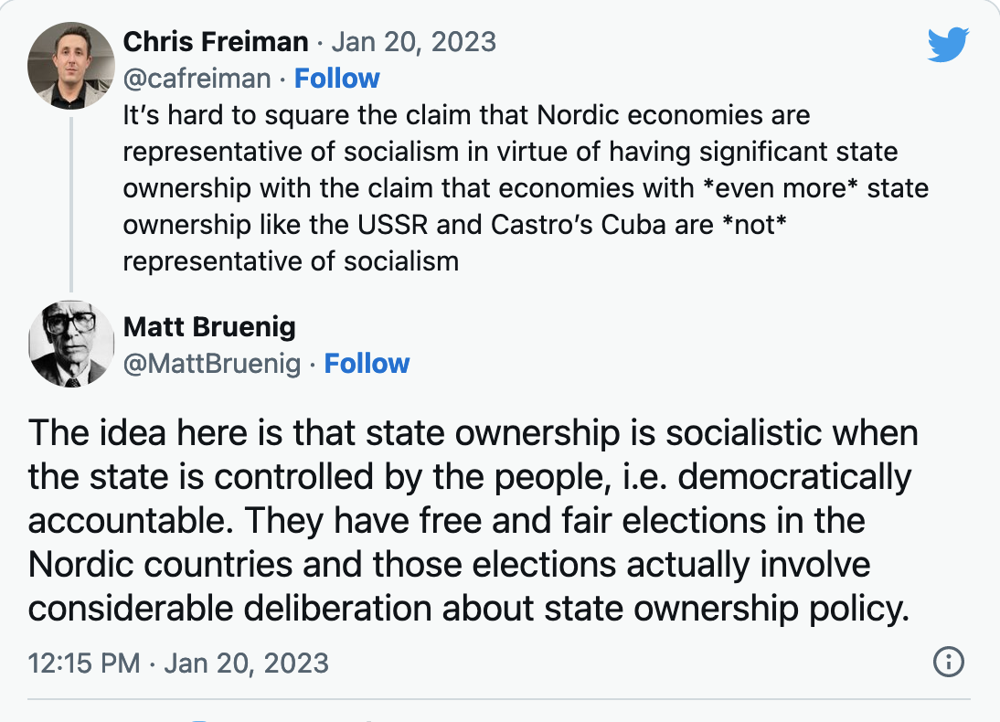
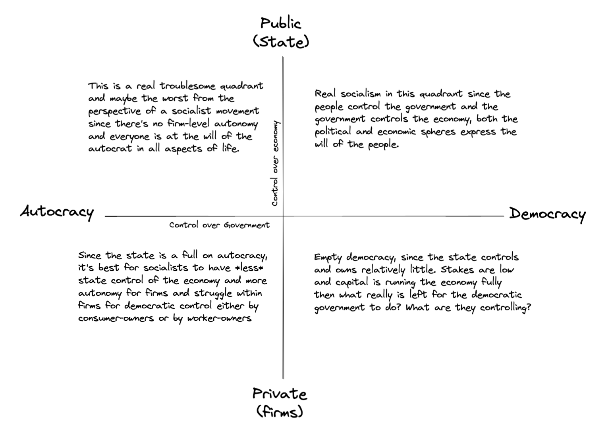

# Economic Control and Ownership

Ownership and control of the economy are the essential tenets of socialism.

Ownership needs to be held by the people or the workers or by the people as workers.

**Socialism via Government Ownership**
A government that has the consent of the people, a democratic government, could be the owning institution to usher in socialism, as long as it remains democratic. Once the government is no longer representative of the people or the workers then the portion of the economy controlled or owned by the government can no longer be tallied in the "Socialist" column. 

I like this definition here:
>The idea here is that state ownership is socialistic when the state is controlled by the people, i.e. democratically accountable. They have free and fair elections in the Nordic countries and those elections actually involve considerable deliberation about state ownership policy.

This is why it is essential for socialism to be married to a democratic state apparatus that represents the people, so that socialists can use the government as the means to worker control over the economy. 

**Socialism via Cooperative Production/Distribution**

Firms privately held by the consumer-owners or worker-owners follows the same principle: the cooperative firm must be governed democratically in order that it fall under "socialist" control. If, say, there were a firm that was owned by the workers, so the workers shared all the surplus produced by the firm, but the board of the firm was not elected nor controlled by the worker-owners, this would also not fall under the socialist tally, since both ownership and control are essential. Democratic cooperative firms, autonomous from the government may be a good option when the government is non-democratic and efforts to make democratic reforms are impossible. As long, of course, that the autocratic state respects the autonomy of the cooperative firms and allows them to function in the same manner as capitalist firms. 

**Socialism and Civil Rights**
Socialist control of the economy may be necessary for all people in the society to be able to participate equally with the same opportunities and outcomes. It seems this is where Martin Luther King, Jr. ended up at the end of his life, supporting union struggles and broadening the scope of his work outside of narrow civil rights. 

On the other hand, civil rights is essential to achieving socialism since we can only put that portion of the economy controlled by the state in the socialist column if it is controlled by a democratic state. A society or economy that doesn't allow certain groups to participate equally or oppresses groups such that they can't feasibly participate cannot be called democratic.

If a government is not democratic and doesn't respect civil rights, but is hands off when it comes to individual firms, then the firms can serve as a refuge, even if they are capitalist. This does not benefit the movement towards socialism, of course, but is a rational and reasonable recourse to an oppressive government. Another reason to support maximalist civil rights demands as a socialist, so that oppressed groups do not flee to the private sector. 

We can depict some of these spectrums and combinations on a two-axis graph:
Government Control
_ Democracy/Autocracy
Economic Control
-Public/Private

