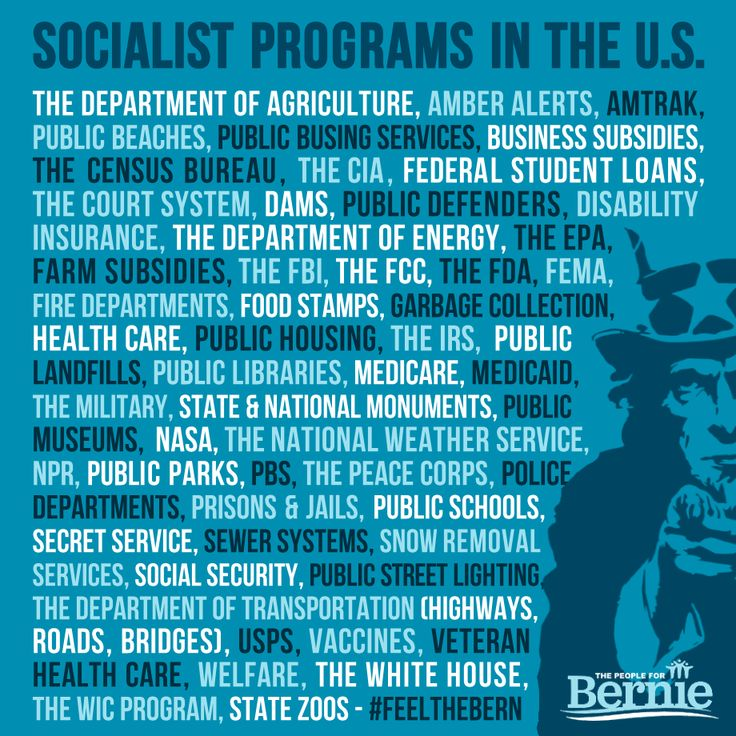

# Models

In a video where Matt Bruenig lays out what socialism looks like at the firm level, he starts off by asking how we might define socialism on a national level and leaves it off pretty quickly that it's hard to define.

If you analyze the economy and calculate the percent of production, or the percent of employment, that is state-run or state-employed, each country will come in somewhere between 0% and 100%. Unless we can imagine a country that has 0% of its economy run or owned by private/capitalist firms, then there will be no country whose economy is 100% socialist.

What composition separates a socialist country from a non-socialist country? 66%? 75%? 99%? Should we conclude that socialism is a spectrum?

It is common to country is socialist if the current political party in power calls themselves socialist. Chile was socialist under Allende, but then it wasn't after the coup of 1973. China is currently socialist. 

The socialisticness or capitalisticness of a country or an economy should be measured instead by the actual composition of the economy. Indeed, the whole may be greater than the sum of its parts, but even so, we can't ignore the parts! I wish we had a better words to talk about this. "Capitalisticness" is terrible. "Business friendly" doesn't really cut it either. 

The capitalist/socialist spectrum should not be conflated with the private/public spectrum. This was a clear point of confusion during the 2015 bernie campaign. Both the [National Review](https://www.nationalreview.com/2015/10/socialism-united-states-meme/) and [Jacobin](https://jacobin.com/2016/01/democratic-socialism-government-bernie-sanders-primary-president/) posted critiques of the meme that was going around everywhere listing any government action as socialism.

